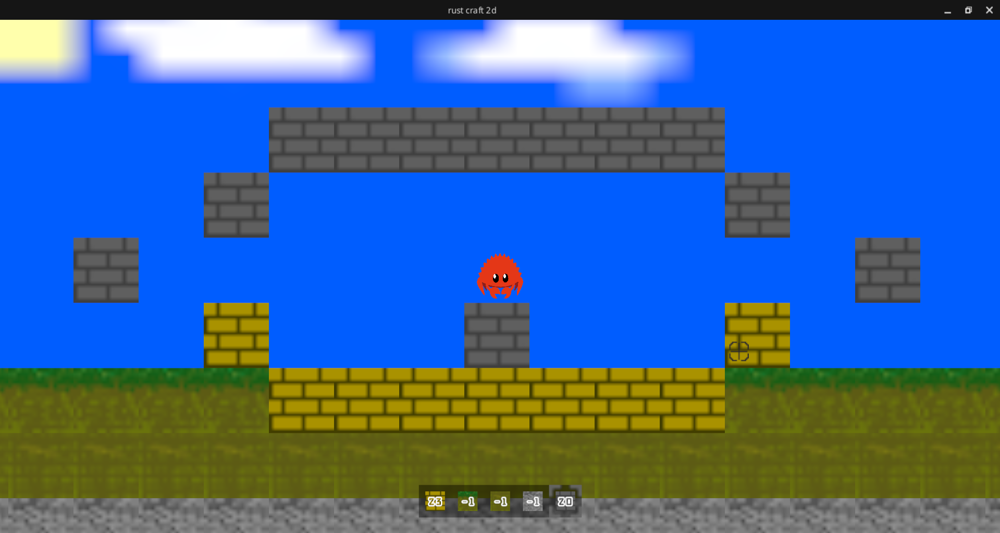

# 项目介绍

一个使用rust+bevy引擎开发的2d开放世界沙盒游戏，此为极简demo版本。


相信对于看到这个项目的各位来说编译一个rust项目肯定是不成问题了，所以。。。
目前暂时只提供源代码，可自行使用cargo进行编译

此项目将 ~~不更新~~ 不定期更新

# 快速开始

1. 前往release下载最新版本并解压（我也不知道我交release没有，没交就直接clone0.2.0版本，目前可用最新）
2. 按照[rust官方教程](https://www.rust-lang.org/zh-CN/learn/get-started)下载并安装rust最新版本
3. 通过命令行打开到项目根目录
4. 执行命令`cargo run`并等待编译完成，游戏窗口出现

# 玩法教程

1. 移动：a向左， d向右
2. 鼠标：使用esc键呼出/取消呼出鼠标
3. 鼠标左键：删除方块
4. 鼠标右键：放置方块
5. 跳跃：空格键
6. 潜行：左shift键（目前潜行没有任何用途，仅仅减慢移动速度，~~狗都不用~~）
7. 切换方块：目前仅可以使用鼠标滚轮切换方块

# 0.2.1新增内容
新增可放置方块数量，-1为无限。
目前不提供可视化调节，可更改gameui.rs中第50-56行
```rust
player_info.player_bar = [
    (Some(GameObjType::Cube(Cube::Plank)), 32),
    (Some(GameObjType::Cube(Cube::GrassCube)), -1),
    (Some(GameObjType::Cube(Cube::SoilCube)), -1),
    (Some(GameObjType::Cube(Cube::StoneCube)), -1),
    (Some(GameObjType::Cube(Cube::StoneBrick)), 32)
];
```
后的数字来更改数量

# 未来更新

不知道，不清楚，不明白

# 已知bug

我要是都已知bug了我还能不修吗？
